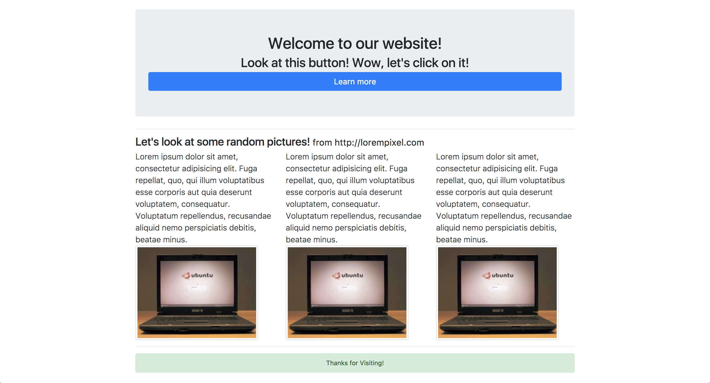
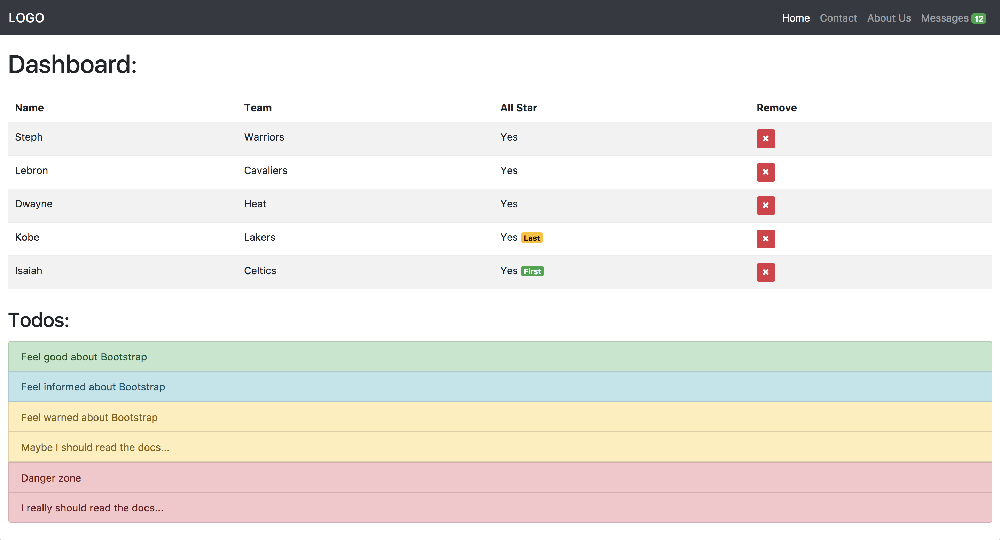

# Patstāvīgais darbs Bootstrap 2

Fake attēliem izmanto [lorem pixel](http://lorempixel.com)

### Uzdevums 1:

Izveido failu page_1.html un uzraksti visu nepieciešamo kodu, lai lapa izskatīto līdzīgi zemāk esošai:

### Uzdevums 2:

Izveido failu page_2.html un uzraksti visu nepieciešamo kodu, lai lapa izskatīto līdzīgi zemāk esošai:

